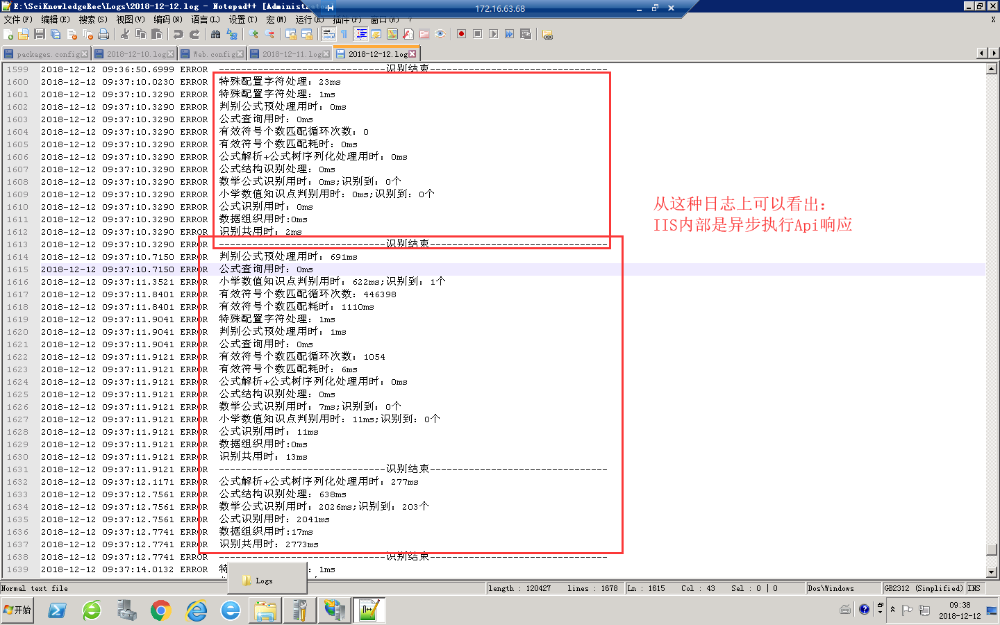

## 关于IIS

> 引言`关于IIS，目前 还仅限于模糊的认识，要成为一个高端民工，IIS运行机制及.Net的底层实现是必须要牢牢掌握的`Web Api内部运行是同步的还是异步的？这明显是新手的问题。对于IIS，确实是尚未入门的新手，就从这里进入吧。

* Web Api是异步执行的。

 截图上第一个圈出来的框框里是一次完整的处理过程日志。而第二个框框里的日志乱掉了，框框里其实一共有两次处理日志的信息，而在第一个虚线区间内不确有两个处理过程的信息交叉。而日志只能打印在一个文本文件当中，这说明同一个Api在被调用时候它的处理过程不是同步串行，而是异步并行的。