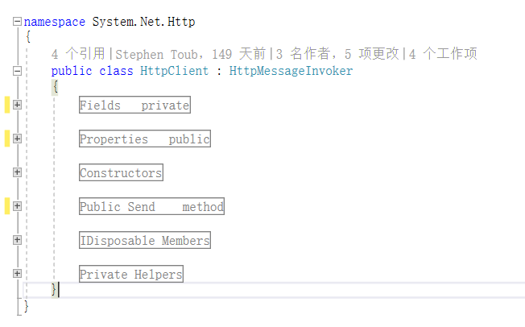

### region using template


模板！模板！模板！
微软的源码还是需要多多看看的，学学代码风格也是好的。
像这个，这就是region使用的模板。
还有代码的命名方式，间距之类。

今天还看到一个这种：
```csharp
if(ture)  str="do something.";
```
虽然说代码块不加`{}`不是太好，但是这种不涉及到作用域问题的用法，这样是很简洁，很提高可读性的。有微软做示范，不就有这样用的底气了嘛。

# 以后一定要好好研究微软的源码！